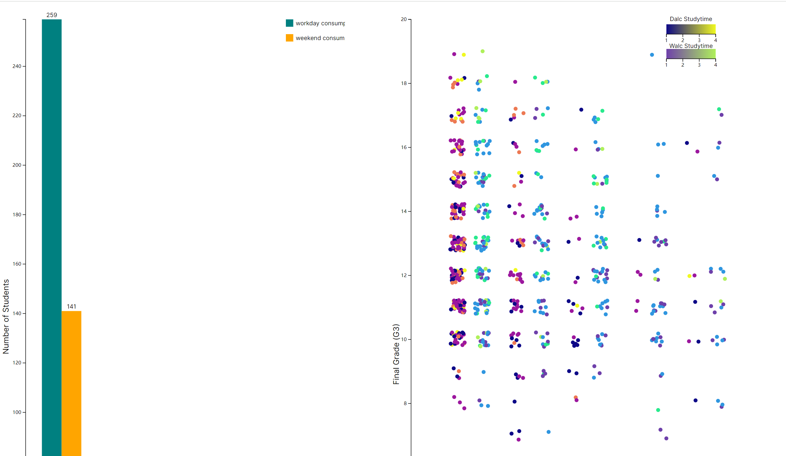

# More about the Framework

This is a template in Vue.js and TypeScript. Vue 3.0 sits between React and basic JavaScript depending on the developers comfort level. For this class we stick with [Options API](https://vuejs.org/api/#options-api) rather than Composition API (not required so you can switch depending on how you feel). 

If you want to use Vue.js but not with TypeScript, just remove any type specifications from the `Example.vue` and `Notes.vue`. You can always refer to `VanillaJS-Template/example.js` for this migration.

## Files You Have to Care about

`package.json` is where we manage the libraries we installed. Besides this, most of the files you can ignore, but **the files under `./src/` are your concern**.

* `./src/main.ts` is the root script file for Vue.js that instatinates our single page application.
* `./src/App.vue` is the root file for all **development** needs and is also where we manage the layout and load in components.
* `./src/types.ts` is usually where we declare our customized types if you're planning to use it.
* `./src/stores/` is where we manage the stores if you're planning to use it. The store is responsible for global state management.
* `./src/components/` is where we create the components. You may have multiple components depends on your design.
  * `Example.vue` shows how to read `.csv` and `.json`, how component size is being watched, how a bar chart is created, and how the component updates if there are any changes. 
  * `Notes.vue` shows the difference of **state** and **prop**, how to use Vuetify, and how a local state updates based on interaction.
  * `NotesWithStore.vue` is equivalent to `Notes.vue`, excepts it is written in Composition API and uses store.

## Libraries Installed in this Framework
 * D3.js v7 for visualization
 * [axios](https://axios-http.com/docs/intro) for API.
 * [pinia](https://pinia.vuejs.org/introduction.html) for store management in Vue.js
 * [Vuetify](https://next.vuetifyjs.com/en/components/all/) for UI that follows Google Material Design 3.
 * [lodash](https://lodash.com/) for utility functions in JavaScript.

## Template Pic

